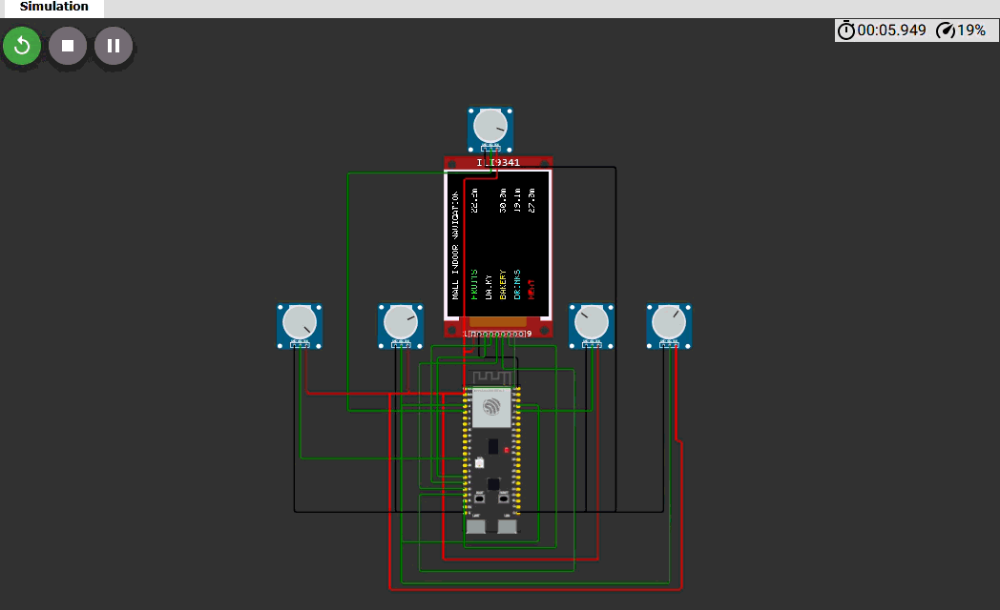

# 📍 Smart Mall Navigation System (ESP32-S3)

 

  

## 🌟 Visual Animation Overview
This project features a **Dynamic Signal Strength UI** on the ILI9341 display:
* **Pulse Bars**: Color-coded signal bars that grow/shrink based on proximity.
* **Real-time Mapping**: ADC data is sampled and smoothed to prevent flickering.
* **Color Feedback**: Individual colors for FRUITS (Green), DAIRY (White), etc., for instant recognition.

---

## 🛠️ Hardware Blueprint

| Component | Pin | Function |
| :--- | :---: | :--- |
| **TFT SCK** | `GPIO 14` | High-speed Clock |
| **TFT MOSI** | `GPIO 13` | Data Transmission |
| **UWB Nodes** | `GPIO 1-5` | Simulated Anchor Signals |

---

## 💻 Logic Flow & Animation Effects
1. **Signal Capture**: The ESP32-S3 reads the 12-bit analog signals (0-4095) from 5 independent nodes.
2. **Proximity Translation**: Data is mapped to a 0.0m - 30.0m range for mall-scale accuracy.
3. **Dynamic UI Rendering**: 
    - The screen performs "Partial Refresh" (fillRect) to update values without screen flicker.
    - Signal bars use a reversed-mapping algorithm: closer products show a larger, more intense pulse bar.

---

## 🚀 How to Run
1. Open the `diagram.json` in Wokwi.
2. Upload `mall_nav.ino`.
3. Interact with the **Potentiometers** to simulate walking through the mall.
